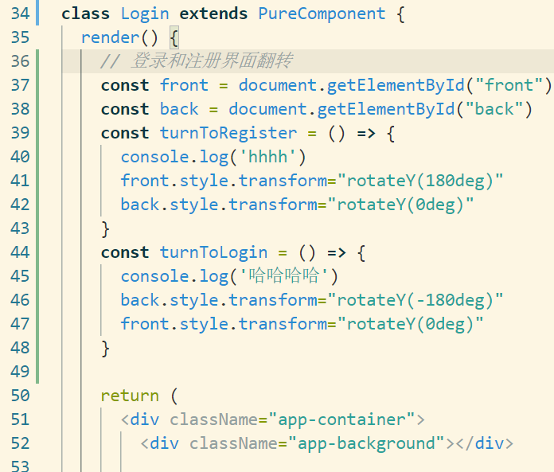

1. 如何搭建 react+ts 的项目架子？
> [使用create-react-app创建ts项目](https://www.cnblogs.com/feiyu159/p/14154963.html)
2. 图片导入，ts不比js，那应该如何操作？
3. 按需引入antd，使组件生效？
> 一开始按照这篇文章去弄：[按需加载](https://blog.csdn.net/weixin_46398902/article/details/104505491)
> > 然而在“自定义”这一块却再次卡住，样式还是不能生效，于是谷歌 [解决方法](https://github.com/ant-design/ant-design-landing/issues/235)  
> > [官网的自定义主题 解决方法也或许有用](https://ant.design/docs/react/use-with-create-react-app-cn)
4. 运行`npm start`时报“内存溢出”？（暂无解决方法）
    ```
    执行 npm 命令时报错：
    FATAL ERROR: Ineffective mark-compacts near heap limit Allocation failed - JavaScript heap out of memory
    ```
> 原因是 JavaScript堆内存不足。Node 是基于V8引擎，在 Node 中通过 JavaScript 使用内存时只能使用部分内存（64位系统下约为1.4 GB，32位系统下约为0.7 GB）
> > 解决方法：手动删除 `node_modules`文件，然后在项目根目录下 `(c)npm install` ，最后就可以 `(c)npm start` 了。
5. 启动并连接mysql数据库，同时打开MySQL workbench可视化工具方便查看数据？
> 在 [mysql官网上](https://dev.mysql.com/downloads/installer/) 安装好mysql后，用命令行启动mysql服务。这时报错：服务名无效，于是在网上找到了：[cmd命令行启动MySQL提示服务名无效/服务无法启动](https://blog.csdn.net/weixin_43720619/article/details/89036335)。没想到一波未平一波又起，mysql还是启动不了，就连【WIN+R，输入services.msc】手动启动都出现警告框：启动后停止，无奈又去找：[Mysql启动后停止的解决方法](https://www.cnblogs.com/pandaly/p/11738789.html)+[MySQL 服务无法启动](https://blog.csdn.net/qq_32682301/article/details/118339414)。这下总算启动mysql服务了。
> > 附：服务一直显示“正在启动”，则 [解决方法传送门](https://www.yisu.com/zixun/28154.html)。如果出现“错误: 无法终止 PID 为 7432 的进程。”则是你的权限问题，可以用管理员权限打开cmd，然后输入命令。   
> 接下来就是连接数据库了
6. 后端服务的着手实现？
> 本项目的后端所采用的的技术栈是 koa+mysql ，这篇文章：[Koa中间件使用之koa-router](https://www.jianshu.com/p/f169c342b4d5)
7. React中实现翻转卡片效果之登录注册，却报错：Cannot read properties of null (reading 'style')？

> 本人最后使用antd的Card组件----页签卡片
8. ts报错：string 元素隐式具有 “any“ 类型，类型为 “string“ 的表达式不能用于索引类型 “{}“？
> 解决方法：在tsconfig.json文件添加配置：
`"suppressImplicitAnyIndexErrors": true`
9. 前端axios发送请求后，接收不到后端响应的数据，报错 Error: Request failed with status code 404？

> 解决方法：我这里是因为对mysql数据库的处理有误：注册的时候没有new一个用户对象，而是直接将前端传过来的用户信息直接存储。因此，使用正确的typeorm语句，即可解决报错
10. 基于Token的身份验证？
> 流程：
> - 1. 用户向服务器发送用户名和密码
> - 2. 服务器验证通过后，创建 session，该 session 是一个键值对，你可以存入【用户账号，登录状态，登录时间】
> - 3. 同时还要设置cookie（这时会将session的相关信息自动存入cookie中，同时通过前后端分别配置，浏览器会自动将该cookie添加到请求头中，以后每次发送请求到服务器后便会自动发送这个cookie）
> - 4. 前端的登录验证，只需要获取session中的登录状态（由后端返回，前端是查找不到的），若通过则跳转至首页；后端的登录验证需要获取请求头中的cookie（之前服务端自定义的）
> - 5. 最后，前后端要设置登录拦截，防止用户在未登录的前提下访问到其他路径，这是不被允许的
11. react如何进行登录拦截？  
由于react并不像Vue一样有路由拦截的api，故需要我们自己实现登录拦截的功能  

有两种方案：
- 在每个组件中，根据 props 上的 history 对象来进行跳转   
- 进行全局的路由守卫处理  

这里采用方法二：
- 需要考虑的点：
- 未登录状态下，访问非登录页，重定向回登录界面
- 未登录状态下，访问无需权限检验的页面，放行
- 登录状态下，访问登录页面，允许
- 登录状态下，访问