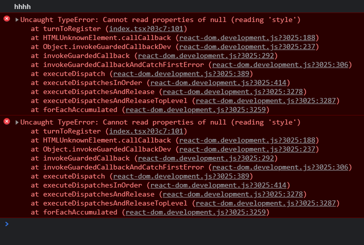

1. 如何搭建 react+ts 的项目架子？
> [使用create-react-app创建ts项目](https://www.cnblogs.com/feiyu159/p/14154963.html)
2. 图片导入，ts不比js，那应该如何操作？
3. 按需引入antd，使组件生效？
> 一开始按照这篇文章去弄：[按需加载](https://blog.csdn.net/weixin_46398902/article/details/104505491)
> > 然而在“自定义”这一块却再次卡住，样式还是不能生效，于是谷歌 [解决方法](https://github.com/ant-design/ant-design-landing/issues/235)  
> > [官网的自定义主题 解决方法也或许有用](https://ant.design/docs/react/use-with-create-react-app-cn)
4. 运行`npm start`时报“内存溢出”？（暂无解决方法）
    ```
    执行 npm 命令时报错：
    FATAL ERROR: Ineffective mark-compacts near heap limit Allocation failed - JavaScript heap out of memory
    ```
> 原因是 JavaScript堆内存不足。Node 是基于V8引擎，在 Node 中通过 JavaScript 使用内存时只能使用部分内存（64位系统下约为1.4 GB，32位系统下约为0.7 GB）
> > 解决方法：手动删除 `node_modules`文件，然后在项目根目录下 `(c)npm install` ，最后就可以 `(c)npm start` 了。
5. 启动并连接mysql数据库，同时打开MySQL workbench可视化工具方便查看数据？
> 在 [mysql官网上](https://dev.mysql.com/downloads/installer/) 安装好mysql后，用命令行启动mysql服务。这时报错：服务名无效，于是在网上找到了：[cmd命令行启动MySQL提示服务名无效/服务无法启动](https://blog.csdn.net/weixin_43720619/article/details/89036335)。没想到一波未平一波又起，mysql还是启动不了，就连【WIN+R，输入services.msc】手动启动都出现警告框：启动后停止，无奈又去找：[Mysql启动后停止的解决方法](https://www.cnblogs.com/pandaly/p/11738789.html)+[MySQL 服务无法启动](https://blog.csdn.net/qq_32682301/article/details/118339414)。这下总算启动mysql服务了。
> > 附：服务一直显示“正在启动”，则 [解决方法传送门](https://www.yisu.com/zixun/28154.html)。如果出现“错误: 无法终止 PID 为 7432 的进程。”则是你的权限问题，可以用管理员权限打开cmd，然后输入命令。   
> 接下来就是连接数据库了
6. 后端服务的着手实现？
> 本项目的后端所采用的的技术栈是 koa+mysql ，这篇文章：[Koa中间件使用之koa-router](https://www.jianshu.com/p/f169c342b4d5)
7. React中实现翻转卡片效果之登录注册，却报错：Cannot read properties of null (reading 'style')？

> 本人最后使用antd的Card组件----页签卡片
8. ts报错：string 元素隐式具有 “any“ 类型，类型为 “string“ 的表达式不能用于索引类型 “{}“？
> 解决方法：在tsconfig.json文件添加配置：
`"suppressImplicitAnyIndexErrors": true`
9. 前端axios发送请求后，接收不到后端响应的数据，报错 Error: Request failed with status code 404？

> 解决方法：我这里是因为对mysql数据库的处理有误：注册的时候没有new一个用户对象，而是直接将前端传过来的用户信息直接存储。因此，使用正确的typeorm语句，即可解决报错
10. 基于session 的身份验证？
> 流程：
> - 1.用户向服务器发送用户名和密码
> - 2.服务器验证通过后，创建 session，该 session 是一个键值对，我存入【登录状态，登录时间】
> - 3.同时还要设置cookie（这时会将session的相关信息自动存入cookie中；同时通过前后端分别配置，浏览器会自动将该cookie添加到请求头中，以后每次发送请求到服务器后便会自动发送这个cookie）
> - 4.前端的登录验证，只需要获取session中的登录状态（由后端返回，前端是查找不到的），若通过则跳转至首页；后端的登录验证需要获取请求头中的cookie（之前服务端自定义的）
> - 5.最后，前后端要设置登录拦截，防止用户在未登录的前提下访问到其他路径，这是不被允许的
11. react如何进行登录拦截？  
由于react并不像Vue一样有路由拦截的api，故需要我们自己实现登录拦截的功能  

有两种方案：
- 在每个组件中，根据 props 上的 history 对象来进行跳转   
- 进行全局的路由守卫处理  

这里采用方法二：
- 需要考虑的点：
  - 未登录状态下，若访问非登录页，则跳转至登录页
  - 登录状态下，随意访问

12. `npm run build` react项目并部署到服务器上，通过配置nginx反向代理等已经可以访问，但只加载了标题，页面仍是白屏状态？
原因：
解决方法：服务器上找到 nginx 安装路径下的 conf 中的 nginx.conf，修改其中 server 的

13. 通过nginx实现跨域？


14. 路由跳转后找不到文件路径，报错404?
当我将本地打包后的前端项目（dist文件夹）上传到服务器的 /usr/local/nginx/html/ 目录下后，在 nginx 正常启动、服务器防火墙以及安全组开放对应端口的前提下，我兴高采烈地打开我的 ip 地址，如我预料的成功打开了前端项目的页面。于是我开始登录注册，但老天爷似乎总喜欢跟人开玩笑，我登录跳转后居然报错：404 Not Found。根据我的另一篇文章 [解决报错的思路]()，这时我应该查看 url 的情况，看它是否符合预期
> [react部署完以后，刷新页面会报错找不到视图](https://www.jianshu.com/p/ffb7e3445414)

15. 引用nodejs模块报错：node_ssh is not a constructor？
```js
const ssh = new node_ssh();
TypeError: node_ssh is not a constructor
```
原因：根据网上的说法，是由于 node 官方尚未解决的一个 bug 导致的。  
解决方法：
```js
const node_ssh = require('node-ssh').NodeSSH;
const ssh = new node_ssh();
```
16. 启动 pm2 报错：Process or Namespace ./src/app not found
```
[PM2][ERROR] Process or Namespace ./src/app.ts not found
[PM2][ERROR] Interpreter /www/server/nvm/versions/node/v14.17.6/lib/node_modules/pm2/node_modules/.bin/ts-node is NOT AVAILABLE in PATH. (type 'which /www/server/nvm/versions/node/v14.17.6/lib/node_modules/pm2/node_modules/.bin/ts-node' to double check.)
```
先看第二个报错，这是因为我的服务器安装了宝塔面板，并在面板里安装了 pm2 管理器，导致与服务器的 pm2 冲突。于是我把宝塔面板中的 pm2 管理器卸载，就没有这个报错了。
那么还有第一个报错，貌似说找不到这个文件？于是我用 xshell 工具连接服务器，在上面启动 pm2 ，但发现居然也不行，

17. 将项目中的脚本上传至服务器并执行时报错：npm: command not found？
```
deploy.sh: line 2: npm: command not found
/usr/bin/env: node: No such file or directory
/usr/bin/env: node: No such file or directory
```
根据网上的解决方法，正解本来应该是 用绝对路径设置软链 ，但笔者的情况很特殊，是由于 /usr/bin/env 命令被修改，导致找不到 node ，这也是在我多方尝试无果之后向阿里提交工单，大佬给出的回复。而大佬的解决方法便是从版本相同的主机 copy 一份 /usr/bin/env 命令到我本机上，这才恢复正常。
注：在服务器上的操作大家一定要慎重，误删文件可能会导致各种很难解决的 bug ，这已经是我第二次遇到特殊情况了。

18. 不能加载静态资源？


19. antd4 点击 Table 时获取当前行的数据？
```js
// 在 Table 下添加属性 onRow
onRow = {(record) => {
  return {
    onClick: () => {
      console.log(record);//这里是点击行的数据，可以把需要的数据存入state，然后在操作栏调用
    }
  }
}
```

20. 获取地址栏中 "?xxx=xxx" ，包括中文字段？
```js
// 自定义函数获取
export function getUrlParam(key: string) {
  // 获取参数
  const url = window.location.search;
  // 正则筛选地址栏
  const reg = new RegExp("(^|&)" + key + "=([^&]*)(&|$)");
  // 匹配目标参数
  const result = url.substr(1).match(reg);
  //返回参数值
  return result ? decodeURIComponent(result[2]) : null;
}
```

21. 同步获取 promise.then() 中的值？
解决方法：Promise封装结合async/await
```js
async componentDidMount() {
  await showPaper().then(res => {
    this.setState({xxx: res.xxx});
  })
}
```
> [React中setState如何同步更新](https://www.cnblogs.com/younghxp/p/14803548.html)

22. 动态获取后端接口响应回来的对象后，设置默认值报错：Uncaught Error: Objects are not valid as a React child (found: object with keys {}). If you meant to render a collection of children, use an array instead.
23. 获取后端返回值后，使用antd4的表单组件并将返回值作为初始值赋给表单？
解决思路：首先查看官方文档，得知可以通过给 <Form> 设置 initialValues ，参数为键值对。但这时候会发现表单值没显示出来，其实是因为 Form 约定 initialValues 只初始化一次。由于本项目使用的是类组件，所以这里通过添加 loading 判断，获取数据成功后设置 false ，再渲染表单
```js
export default class Modify extends React.Component{
  this.state = { loading: true };

  // 调用后端接口，然后将 loading 设置为 false
  showPaper().then(res => {
    this.setState({ loading: false });
  })

  render() {
    const { loading } = this.state
    return(
      {!loading && (
        <Form initialValues={detail}>
          <Form.Item name="age" label="age">
            <Input />
          </Form.Item>
        </Form>
      )}
    )
  }
}
```

24. 封装下拉菜单？

25. React 封装 wangeditor 富文本编辑器？

26. 两个字符串（yyyy-mm-dd 形式）如何作减法？
解法一：typescript 项目可以导入[ date-fns 包](https://blog.csdn.net/fsxxzq521/article/details/85715213)，这个包封装了对日期的一系列操作，其中可以使用 `differenceInDays(): 获得两个时间相差几天` ，然后再做剑法即可。
解法二：为了求个日期之间的天数而引入一个包，这样其实不太好，能不依赖包就尽量不依赖比较好，所以我就自己封装了一个方法去求出我想要的数值
```js

```
27. 如何获取富文本编辑器中的内容？
28. 在一个组件中调用另一个组件中的方法？

